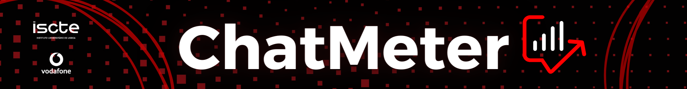
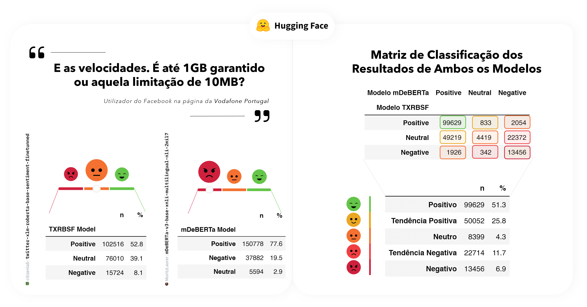
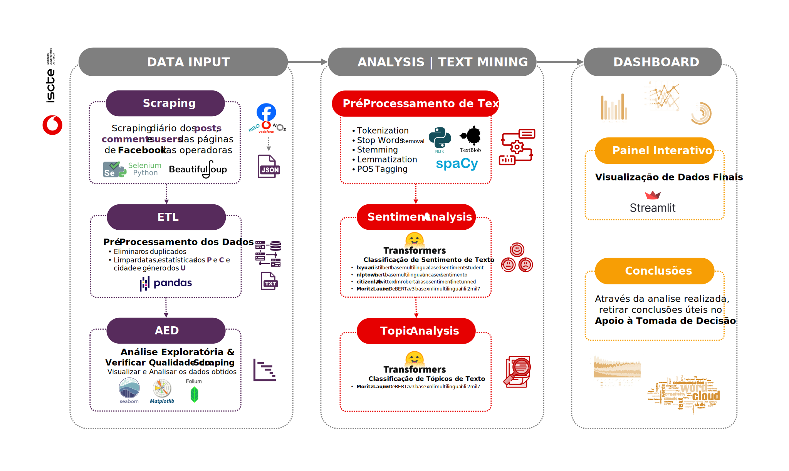

   

# 💬 ChatMeter : AI Competitive Intelligence Solution 💡

## 📝 Description

ChatMeter is an AI-powered solution designed to analyze and understand the competitive landscape of **telecommunications operators** in the **Portuguese** 🇵🇹 market by monitoring social media. It helps businesses gain insights into customer sentiment, emerging trends, and competitor strategies.

    
    
    
    

## ✨ Objective

The primary objective of ChatMeter is to **develop a *"Sentiment and Topic Thermometer"* for Portuguese telecommunications operators**, enabling:

*   Identification of user needs, preferences, and behaviors on social media.
*   Discovery of new opportunities, trends, and challenges in the sector.
*   Support for informed decision-making in the telecommunications market.

    

## 🏗️ Project Structure (CRISP-DM)

This project followed the CRISP-DM methodology for data mining. Here's a breakdown of the key activities in each phase:

1.  **Business Understanding:** 💡
    *   Defined project goals: Analyze social media data to understand the competitive landscape of telecom operators.
    *   Identified key players: **`Vodafone`** 🔴, **`MEO`** 🔵, **`NOS`** ⚫, and **`DIGI`** 🟡.

  

    
    
    

2.  **Data Understanding:** 🔍
    *   Collected data from Facebook pages of telecom operators using web scraping.
    *   Explored the structure and format of the collected data (posts, comments, user information).
    *   Assessed data quality and identified potential issues (missing values, duplicates).

    
    
    
    

3.  **Data Preparation:** 🛠️
    *   **Data Cleaning:** Removed duplicate entries, handled missing values, and corrected inconsistencies in the data.
    *   **Text Preprocessing:** Converted text to lowercase, removed URLs, punctuation, stopwords, and applied stemming and lemmatization.
    *   **Feature Engineering:** Created new features, such as a binary variable to indicate if the text mentions a specific operator.
 

    
    
    
    
    

4.  **Modeling:** 🤖 
   
    *   **Sentiment Analysis:** Applied pre-trained transformer models (**[`TXRBSF`](https://huggingface.co/citizenlab/twitter-xlm-roberta-base-sentiment-finetunned)** and **[`mDeBERTa`](https://huggingface.co/MoritzLaurer/mDeBERTa-v3-base-xnli-multilingual-nli-2mil7)**) to ***classify the sentiment*** of the text **( positive  /  neutral  /  negative **).
  
    

 
      
    *   **Topic Analysis:** Utilized ***Zero-Shot Classification*** with the **`mDeBERTa`** model to identify the main topics discussed in the text.

    

  
  

5.  **Evaluation:** ✅
    *   Create a new matrix to combine the sentiment and topic analysis results.
    *   Tested for significance using the Chi-Squared Test.
  

    
    

6.  **Deployment:** 🚀

    *   Developed an interactive dashboard using **[Streamlit](https://chatmeter.streamlit.app/)** to visualize the results and insights.
  

    
    

 

---

 

## **🗺️ Workflow**

The project workflow can be summarized as follows:

   

---

## **📊 Dashboard**

Access the interactive dashboard here: [**`ChatMeter - Streamlit App`**](https://chatmeter.streamlit.app/)

   

 

**Note**: This project was developed in **PT-🇵🇹**.
